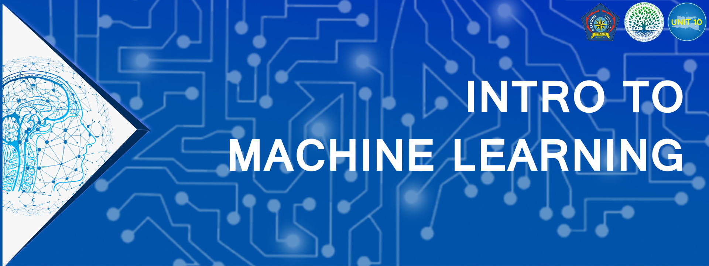

# Webinar Upgrade Skill Intro to Machine Learning

Merupakan sebuah event untuk meningkatkan skill peserta serta pengetahuan dalam bidang teknologi. event ini diselenggarakan dalam 2 sesi yang diselenggarakan pada tanggal 5 Agustus dan 12 Agustus 2020 melalui media daring Zoom meeting atau Google meet.

## Sesi 1 : Intro To Machine Learning & Machine Learning For Prediction

pada sesi 1 ini, membahas tentang dasar machine learning, teori tentang machine learning, dan membahas algoritma machine learning yang digunakan untuk prediksi. Algoritma yang dibahas pada pertemuan ini antara lain Linear Regression, Polynomial Regression, Autoregressive Integrated Moving Average (ARIMA), dan Long Short Term Mermory (LSTM).
Pada sesi ini juga peserta akan mendapatkan challenge berupa membuat sebuah permodelan machine learning untuk prediksi berbasis timeseries.

## Sesi 2 : Intro to Deep Learning & Computer Visual Recognation

### (COMING SOON 12 August 2020)
